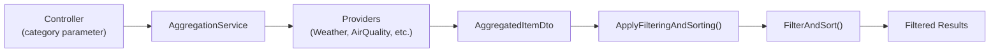

# Filtering & Sorting Mechanism

## ?? Overview

The API Aggregator supports **automatic filtering and sorting** for any data provider whose DTOs implement the `IFilterable` interface. This allows clients to:
- Filter results by **category**
- Automatically sort by **creation date** (newest first)
- Exclude items without valid timestamps

---

## ??? Architecture

### Flow Diagram



### Key Components

| Component | Location | Purpose |
|-----------|----------|---------|
| `IFilterable` | `Interfaces/IFilterable.cs` | Contract for filterable DTOs |
| `FilterableExtensions` | `Extensions/FilterableExtensions.cs` | Filtering logic |
| `FilterAndSortExtensions` | `Extensions/FilterAndSortExtensions.cs` | Generic filter/sort utilities |
| `AggregationService` | `Features/Aggregation/AggregationService.cs` | Applies filtering after data collection |

---

## ?? How It Works

### 1?? **The `IFilterable` Interface**

```csharp
public interface IFilterable
{
    DateTime? CreatedAt { get; }
    string? Category { get; }
    int? Relevance { get; }
}
```

**Properties:**
- `CreatedAt`: Timestamp for sorting (items without this are **excluded**)
- `Category`: Used for filtering (exact match)
- `Relevance`: Reserved for future use

---

### 2?? **Filtering Rules**

#### **Category Filtering**
```csharp
private static bool MatchesCategory(IFilterable item, string? category)
{
    return category == null || item.Category == category;
}
```

| Scenario | Result |
|----------|--------|
| `category = null` | Returns **all** items |
| `category = "Sports"` | Returns only items where `Category == "Sports"` (case-sensitive) |

#### **Date Validation**
```csharp
.Where(x => x.CreatedAt.HasValue)
```
Items **without** a `CreatedAt` value are **automatically excluded** from results.

#### **Automatic Sorting**
```csharp
.FilterAndSort(
    filter: x => MatchesCategory(x, category),
    sortBy: x => x.CreatedAt!.Value,
    descending: true  // Newest first
)
```
Results are **always** sorted by `CreatedAt` in **descending order** (newest ? oldest).

---

### 3?? **Execution Flow**

```csharp
public async Task<AggregatedItemDto> GetAggregatedData(
    string ip,
    string? category = null,
    // ... other parameters
)
{
    // 1. Get location from IP
    var location = await _geoClient.GetLocationByIpAsync(ip, cancellationToken);

    // 2. Call all providers in parallel
    var tasks = _providers.ToDictionary(
        p => p.Name,
        p => p.GetDataAsync(location.Latitude, location.Longitude, cancellationToken));
    await Task.WhenAll(tasks.Values);

    // 3. Aggregate results
    var aggregated = new AggregatedItemDto(/* ... */);

    // 4. ? Apply filtering & sorting
    aggregated.ApplyFilteringAndSorting(category);

    return aggregated;
}
```

**Step 4 Details:**
```csharp
public static void ApplyFilteringAndSorting(this AggregatedItemDto aggregated, string? category)
{
    foreach (var key in aggregated.Data.Keys.ToList())
    {
        // Only process collections that implement IFilterable
        if (aggregated.Data[key] is IEnumerable<IFilterable> items)
        {
      aggregated.Data[key] = FilterAndSortItems(items, category).ToList();
        }
    }
}
```

---

## ?? Adding Filtering to Your API Client

### ? Prerequisites

Your DTO must:
1. Implement the `IFilterable` interface
2. Provide valid `CreatedAt`, `Category`, and `Relevance` properties
3. Be returned as an `IEnumerable<T>` from your provider

### ?? Step-by-Step Example

#### **Step 1: Create a Filterable DTO**

```csharp
using APIAggregator.API.Interfaces;

namespace APIAggregator.API.Features.News
{
    public record NewsArticleDto(
        string Title,
        string Content,
        string Author,
        string Url
    ) : IFilterable
    {
 // IFilterable implementation
    public DateTime? CreatedAt { get; init; }
        public string? Category { get; init; }
     public int? Relevance { get; init; }
    }
}
```

#### **Step 2: Implement the Provider**

```csharp
using APIAggregator.API.Interfaces;

namespace APIAggregator.API.Features.News
{
    public class NewsApiClient : ILocationDataProvider
    {
        public string Name => "News";

public async Task<object> GetDataAsync(double lat, double lon, CancellationToken ct)
        {
            // Fetch news articles for the location
          var articles = await FetchNewsFromExternalApi(lat, lon, ct);

            // Return as IEnumerable<NewsArticleDto>
         return articles.Select(a => new NewsArticleDto(
   Title: a.Title,
    Content: a.Content,
       Author: a.Author,
     Url: a.Url
          )
        {
    CreatedAt = a.PublishedAt,
       Category = a.Category, // e.g., "Sports", "Technology", etc.
             Relevance = a.ViewCount
            }).ToList();
        }
    }
}
```

#### **Step 3: Register the Provider**

```csharp
// In Program.cs
builder.Services.AddScoped<ILocationDataProvider, NewsApiClient>();
```

#### **Step 4: Test the Filtering**

```bash
# Get all news articles
GET /api/aggregation?ip=8.8.8.8

# Get only sports news
GET /api/aggregation?ip=8.8.8.8&category=Sports

# Get only technology news
GET /api/aggregation?ip=8.8.8.8&category=Technology
```

---

## ?? Example API Response

### Without Filtering
```bash
GET /api/aggregation?ip=8.8.8.8
```

```json
{
  "city": "Mountain View",
  "country": "United States",
  "data": {
    "News": [
      {
        "title": "Tech Giants Announce New AI Features",
        "category": "Technology",
 "createdAt": "2024-01-15T10:30:00Z"
      },
      {
  "title": "Local Sports Team Wins Championship",
     "category": "Sports",
     "createdAt": "2024-01-14T18:00:00Z"
      },
{
        "title": "Breaking: Market Hits All-Time High",
        "category": "Finance",
        "createdAt": "2024-01-13T09:15:00Z"
      }
    ]
  }
}
```

### With Category Filter
```bash
GET /api/aggregation?ip=8.8.8.8&category=Sports
```

```json
{
  "city": "Mountain View",
  "country": "United States",
  "data": {
    "News": [
      {
      "title": "Local Sports Team Wins Championship",
        "category": "Sports",
        "createdAt": "2024-01-14T18:00:00Z"
      }
 ]
  }
}
```

---

## ?? Current Limitations

### 1. **Cache Doesn't Respect Filtering**
```csharp
var cacheKey = $"Aggregated:{ip}";  // ? Missing category parameter
```

**Issue:** The `CachedAggregationService` caches results by IP only, not by `(IP, category)` combination.

**Impact:** 
- First request: `?ip=1.1.1.1&category=Sports` ? fetches and caches **all** data
- Second request: `?ip=1.1.1.1&category=Tech` ? returns cached data (still filtered for Sports)

**Workaround:** Filtering happens **after** cache retrieval, so results are still correct, but cache efficiency is reduced.

### 2. **Controller Parameters Not Used**
```csharp
public async Task<ActionResult<AggregatedItemDto>> GetAggregatedData(
    [FromQuery] string? sortBy = null,      // ? Not used
    [FromQuery] bool descending = false,    // ? Not used
    // ...
)
```

**Issue:** The API accepts `sortBy` and `descending` parameters but **always** sorts by `CreatedAt DESC`.

**Recommendation:** Either:
- Remove these parameters from the controller signature
- Implement dynamic sorting based on these parameters

### 3. **Case-Sensitive Category Matching**
```csharp
return category == null || item.Category == category;
```

**Issue:** `category=sports` ? `category=Sports`

**Recommendation:** Consider using `StringComparison.OrdinalIgnoreCase`:
```csharp
return category == null || 
       string.Equals(item.Category, category, StringComparison.OrdinalIgnoreCase);
```

---

## ?? Best Practices

### ? DO

1. **Always provide `CreatedAt`**
   ```csharp
   CreatedAt = DateTime.UtcNow  // ? Include timestamp
   ```

2. **Use consistent category names**
   ```csharp
   Category = "Sports"  // ? Use PascalCase
   ```

3. **Return collections from providers**
   ```csharp
   return articles.ToList();  // ? IEnumerable<IFilterable>
   ```

### ? DON'T

1. **Don't return single objects**
   ```csharp
   return new NewsArticleDto(...);  // ? Won't be filtered
   ```

2. **Don't mix filterable and non-filterable items**
   ```csharp
   return new { 
       Filterable = articles,   // ? Nested collections won't work
       Other = metadata 
   };
   ```

3. **Don't forget to implement all IFilterable properties**
   ```csharp
   public string? Category => null;  // ? Will never match filters
   ```

---

## ?? Testing Your Implementation

### Unit Test Example

```csharp
[Fact]
public async Task Provider_Returns_Filterable_Items()
{
    // Arrange
    var provider = new NewsApiClient(/* dependencies */);

    // Act
    var result = await provider.GetDataAsync(37.7749, -122.4194, CancellationToken.None);

    // Assert
    Assert.IsAssignableFrom<IEnumerable<IFilterable>>(result);
    
    var items = (result as IEnumerable<IFilterable>).ToList();
    Assert.All(items, item => 
    {
        Assert.NotNull(item.CreatedAt);
        Assert.NotNull(item.Category);
    });
}
```

### Integration Test Example

```csharp
[Fact]
public async Task Aggregation_Filters_By_Category()
{
    // Arrange
    var client = _factory.CreateClient();

    // Act
    var response = await client.GetAsync("/api/aggregation?ip=8.8.8.8&category=Sports");
    var result = await response.Content.ReadFromJsonAsync<AggregatedItemDto>();

    // Assert
    var newsItems = result.Data["News"] as IEnumerable<IFilterable>;
    Assert.All(newsItems, item => Assert.Equal("Sports", item.Category));
}
```

---

## ?? Related Files

| File | Description |
|------|-------------|
| `Interfaces/IFilterable.cs` | Interface definition |
| `Extensions/FilterableExtensions.cs` | Filtering logic implementation |
| `Extensions/FilterAndSortExtensions.cs` | Generic filter/sort utilities |
| `Features/Aggregation/AggregationService.cs` | Where filtering is applied |
| `Features/Aggregation/CachedAggregationService.cs` | Cache decorator (filtering aware) |

---

## ?? See Also

- [Main README](../../../README.md) - Project overview and setup
- [Architecture Documentation](../Aggregation/README.md) - Overall system design
- [Provider Guide](../README.md) - How to add new data providers

